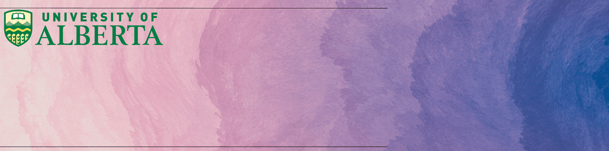

  

<h1 align="center">Hi , I'm Hasan</h1>  

  
⚒️ I'm currently a fourth-year Computer Science major at the University of Alberta working at <a href="https://www.nvidia.com/" target="_blank">nvidia</a> as a Software Engineer Intern. ⚒️  
   
🏆 2x Hackathons (Top 10) 🏆
   
🚩 7 Capture the Flag (CTF)🚩
   
🖥️ Passionate about Compilers, CyberSecurity, Cloud Computing, Product Management, and Software Engineering 🖥️

  

  
  &#8287;&#8287;&#8287;&#8287;&#8287;
  
  &#8287;&#8287;&#8287;&#8287;&#8287;
  
  &#8287;&#8287;&#8287;&#8287;&#8287;
  

<picture>
  <source
    media="(prefers-color-scheme: dark)"
    srcset="https://raw.githubusercontent.com/platane/snk/output/github-contribution-grid-snake-dark.svg"
  />
  <source
    media="(prefers-color-scheme: dark)"
    srcset="https://raw.githubusercontent.com/platane/snk/output/github-contribution-grid-snake.svg"
  />
  
</picture>

## 🚀 Languages and Tools:

  
  
  
  
  
  
  
  
  
  
  
  
  
  
  
  
  
  
  
  
  
  

<h3>My projects</h3>
<table>
  <thead align="center">
    <tr border: none;>
      <td><b>📽️ Projects</b></td>
      <td><b>🛠️ Tools</b></td>
      <td><b>📚 Features</b></td>
    </tr>
  </thead>
  <tbody>

  <td><a href="https://github.com/daksh3333/Neuro-Stress-Monitor"><b>🏆FocusBoost</b></a></td>
  <td>
    
    
    
    
    
  </td>
  <td>
    <ul>
      <li>natHACKS fall 2024 submission for rehabilitation track made by a group of 6 students from diverse majors</li>
      <li>Analyzes EEG brainwave data from BioAmp EXG Pill to detect focus levels.</li>
      <li>Provides real-time notifications and motivational alerts via an Electron app.</li>
      <li>Integrates with Chromium to monitor focus while watching YouTube or browsing.</li>
      <li>Uses audio-visual alerts and motivational content (e.g., quotes from David Goggins) to encourage productivity.</li>
      <li>Implements customizable focus tracking thresholds and distraction alerts for tasks like studying or working.</li>
      <li>🌐 Check out the project on <a href="https://devpost.com/software/neuro-stress-monitor" target="_blank"><b>Devpost</b></a>.</li>
    </ul>
  </td>
</tr>
    <tr>
      <td><a href="https://github.com/osu/AI-Powered-Disease-Detection-in-X-Ray-Images"><b>AI Diesease Detection</b></a></td>
      <td>
          
          
          
          
          
      </td>
      <td>
        <ul>
        <li>AI-Powered Disease Detection: This project leverages Convolutional Neural Networks (CNNs) for disease detection, focusing on pneumonia in chest X-rays, providing a framework for accurate and early diagnostics.</li>
        <li>Flexible and Optimized Framework: Includes customization options (data augmentation, hyperparameters, transfer learning) and supports OpenVINO integration for faster inference on Intel hardware.</li>
        <li>Comprehensive Performance Metrics: Evaluates model performance with accuracy, precision, recall, and AUC, with sample results available for visual inspection and benchmarking.</li>
          </ul>
      </td>
    </tr>
    <tr>
      <td><a href="https://github.com/osu/Spotify-Top-Songs-2021-Data-Analysis"><b>Spotify Data Analysis</b></a></td>
      <td>
      
  
  
  
  
      </td>
      <td>
      <ul>
<li>Developed an analytical pipeline using Python and SQLite to analyze and visualize Spotify’s top 50 songs of 2021.</li>
<li>Implemented SQL queries to extract insights, including the top 10 longest songs and average danceability by artist.</li>
<li>Generated bar and pie charts with Matplotlib for data visualization, automating the process through a Python script.</li>
        </ul>
      </td>
      <tr>
  <td><a href="https://github.com/osu/cybersci-2024"><b>CyberSci 2024</b></a></td>
  <td>
    
    
    
    
    
    
    
    
    
  </td>
  <td>
    <ul>
      <li>Represented University of Alberta in CyberSci 2024 Capture the Flag (CTF) competition.</li>
      <li>Collaboratively solved cryptography, cloud security, and forensics challenges, ranking in the top tier.</li>
      <li>Successfully cracked challenges like <b>"Leaked and Loaded"</b> and <b>"Data is the New Currency"</b>.</li>
      <li>Developed write-ups for solved challenges to guide future participants in tackling similar problems.</li>
      <li>Enhanced teamwork, critical thinking, and cybersecurity skills while preparing and competing.</li>
    </ul>
  </td>
</tr>
    </tr>
    <tr>
      <td><a href="https://github.com/osu/Beartracks"><b>Beartracks - Barebones <b></a></td>
      <td>
      
  
      </td>
      <td>
      <ul>
<li>Developed a student timetable application to manage course enrollments, drops, and display current timetables.</li>
<li>Integrated user enrollment functionality, allowing new students to be added with admin authentication.</li>
<li>Used Streamlit to create a user-friendly GUI for displaying application outputs.</li>
        </ul></td>
    </tr>
        <tr>
      <td><a href="https://github.com/adnansami1992sami/QNNGPD"><b>🏆QNNGPD<b></a></td>
      <td>
      
  
  
  
  
      </td>
      <td>
      <ul>
<li>This project was made for intel fall 2024 hackathon</li>
<li>Developed Quantum Neural Networks (QNNs) for analyzing genomic data in personalized medicine to predict disease risks and recommend treatments.</li>
<li>Implemented a hybrid model integrating classical neural networks (CNNs) and QNNs to handle high-dimensional genomic patterns.</li>
<li>Utilized Intel Quantum Simulator, OpenVINO, and Intel DevCloud for model training, testing, and edge inference deployment.</li>
        </ul></td>
    </tr>
    <tr>
  <td><a href="https://github.com/osu/simple-X"><b>Simple-X Twitter Mini Project</b></a></td>
  <td>
    
    
    
  </td>
  <td>
    <ul>
      <li>Developed a barebones Twitter-like application for users to create, search, and interact with tweets.</li>
      <li>Implemented secure authentication and database integration using SQLite.</li>
      <li>Built a GUI interface with Tkinter for user-friendly navigation.</li>
      <li>Handled features like hashtags, followers, user profiles, and tweet feeds.</li>
      <li>Ensured cross-platform compatibility and parameterized queries to prevent SQL injection.</li>
    </ul>
  </td>
</tr>
    <tr>
      <td><a href="https://github.com/osu/Recon-Automation"><b>File Automation</b></a></td>
      <td>
  
  
      </td>
      <td>
      <ul>
<li>Automated File and Data Handling: Automates file extraction, data processing, and Excel manipulations, using libraries like <code>openpyxl</code>, <code>pandas</code>, and <code>win32com</code> (Windows-only) for reconciliation tasks.</li>
<li>Excel Operations: Formats cells, creates tables, and applies formulas within Excel, leveraging <code>openpyxl</code> and <code>win32com</code> for smooth workflow automation.</li>
<li>Cross-Platform Note: Designed for Windows, but can be adapted for other platforms by replacing <code>win32com</code> with cross-compatible libraries for Excel handling.</li>
        </ul>
      </td>
    </tr>
    <tr>
      <td><a href="https://github.com/osu/Maze-Pathfinder"><b>Maze Pathfinder</b></a></td>
      <td>
  
  
      </td>
      <td>
      <ul>
<li>A solvable maze is generated using Kruskal’s algorithm.</li>
<li>The maze is solved using Dijkstra and A* algorithms.</li>
<li>Animated pathfinding visualizes the solution path.</li>
<li>Allows generation of different paths with a button click.</li>
        </ul>
      </td>
    </tr>
  <tr>
      <td><a href="https://github.com/osu/quiz"><b>Quiz</b></a></td>
      <td>
  
  
  
  
      </td>
      <td>
      <ul>
      <li>A Windows Forms-based quiz application designed with a user-friendly and visually appealing interface.</li>
      <li>Includes a registration form for users to input their details before starting the quiz.</li>
      <li>Features a dynamic timer and progress bar for each question to enhance the quiz-taking experience.</li>
      <li>Customizable background images for both the quiz and registration forms (e.g., <code>joes.png</code>, <code>apd.jpg</code>).</li>
      <li>Automated email functionality using SendGrid to deliver quiz results directly to the participant's email.</li>
      <li>📽️ Check out the <a href="https://youtu.be/b5_Xrl0sDsk" target="_blank"><b>demo</b></a> of the application in action.</li>
      <li>Future plans include integrating AI to dynamically generate quiz questions for an enhanced experience.</li>
        </ul>
      </td>
    </tr>
  </tbody>

</a>

